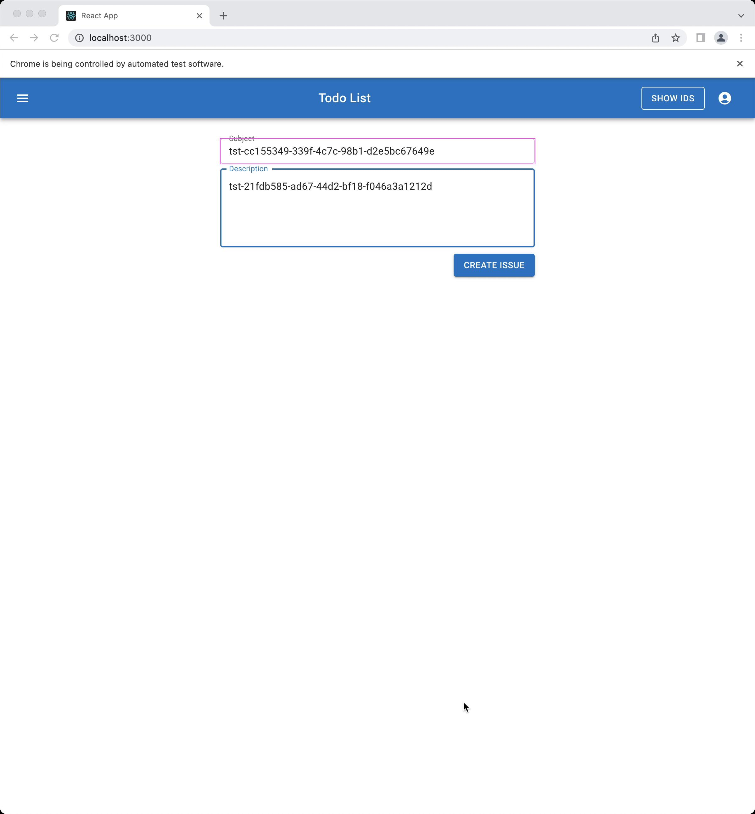
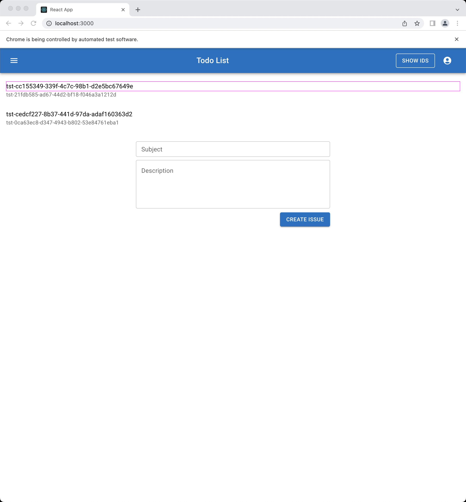
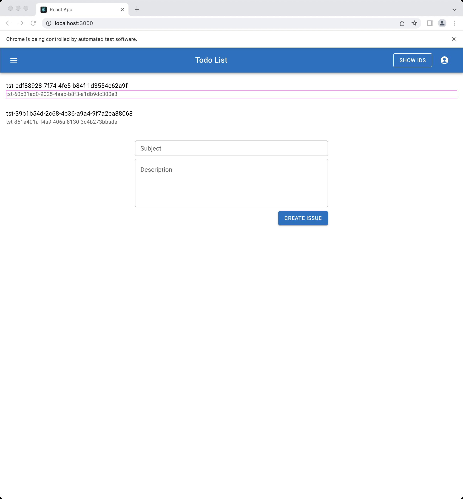

## Change List:
| Link | Section |
|------|---------|
| [Change #1](#change-1) | Todo List |
| [Change #2](#change-2) | Todo List |

Base

Stats: 

| Item | Count | Description |
|------|-------|-------------|
| Control Variables | 1 | Variables that affect what content is shown |
| Display Variables | 4 | Variables are shown (e.g. person.firstName) |
| Visual Elements | 60 | Higher level display elements (e.g. box, header) |
| Sub-Blocks | 8 | Parts of sub-functionality we identified |

Todo List

###  Change #1
| Before | After |
|--------|-------|
|  |  | 
|  |  | 

Description:  Changed display: used to show **Subject**, now shows **Description**

Ref: 1

###  Change #2
| Before | After |
|--------|-------|
|  |  | 
|  |  | 

Description:  Changed display: used to show **Description**, now shows **Subject**

Ref: 2

Stats: 

| Item | Count | Description |
|------|-------|-------------|
| Control Variables | 0 | Variables that affect what content is shown |
| Display Variables | 2 | Variables are shown (e.g. person.firstName) |
| Visual Elements | 6 | Higher level display elements (e.g. box, header) |
| Sub-Blocks | 3 | Parts of sub-functionality we identified |

